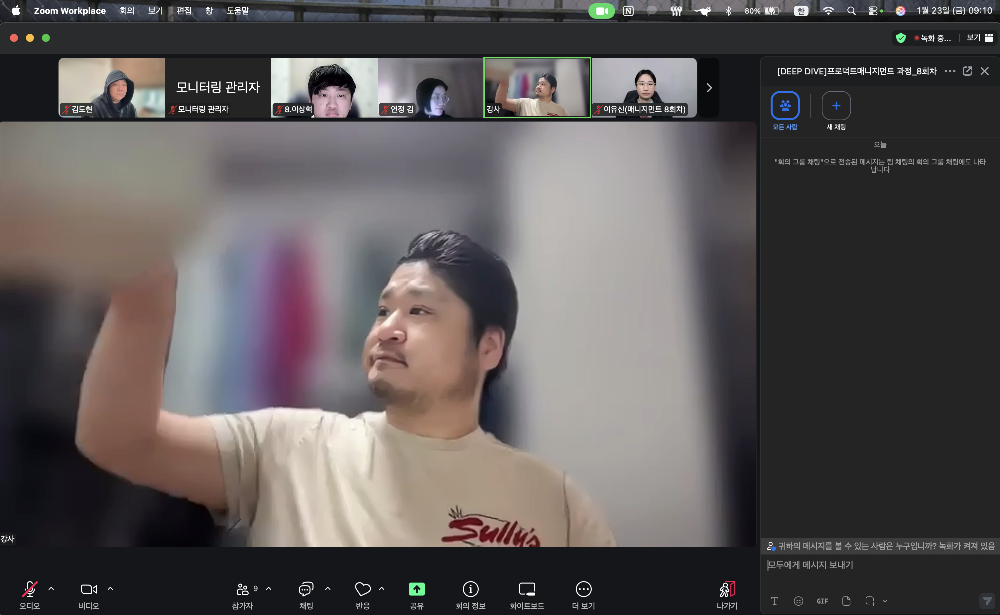
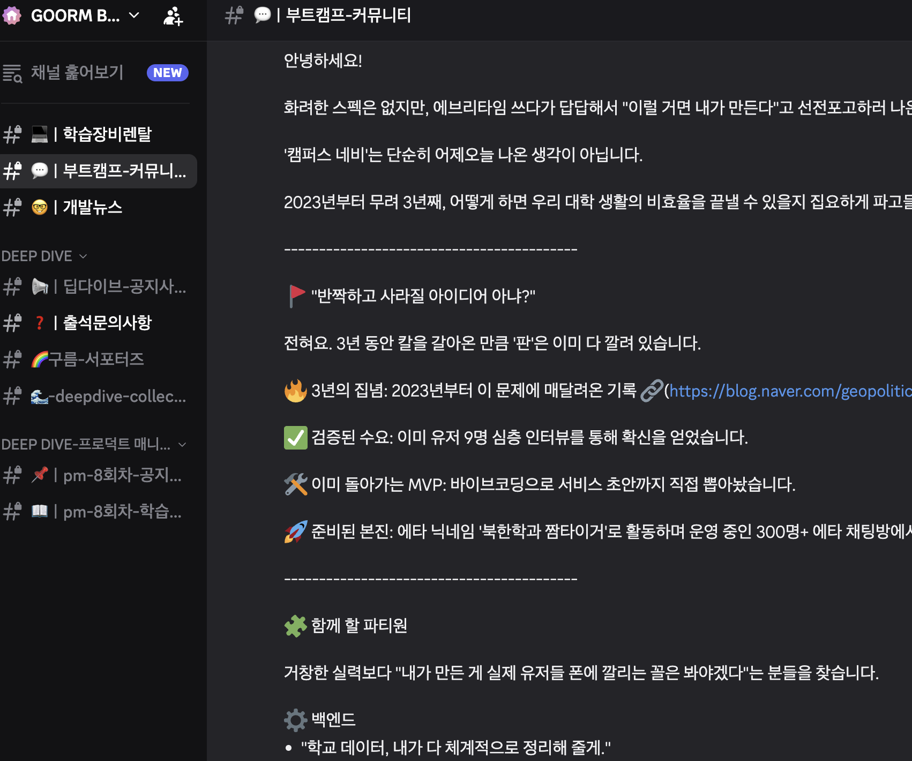
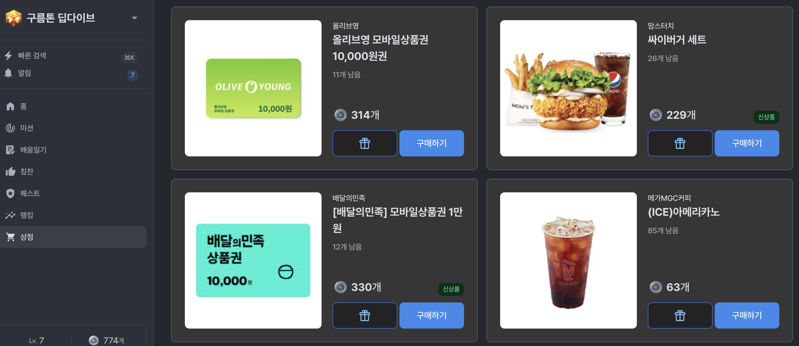

```
[구름서포터즈]
본 콘텐츠는 구름 서포터즈 활동으로 지원을 받아 작성된 교육생의 실제 경험 후기입니다.
```

# 구름 프로덕트 매니지먼트 마스터과정 첫달!
```
드디어 과정의 첫걸음을 시작했습니다. 두구두구두구!!
이제까지의 거의 모든 학습은 오프라인으로 해왔던 지라 온라인 실시간 강의는 처음이라서 기대와 걱정(?)이
```

```
우선 온라인 실시간은 Zoom을 활용한 강의임.
Zoom을 많이 안써봤는데 생각보다 화질 / 음성 모두 퀄리티가 좋음.
우선 스샷에 중앙에 보이는 분은 강사님!(강사님에 대한건 나중에 또 작성하겠음)
```


```
학습관련 커뮤니티 관련 등등 현재 구름에서 공부하고있는 모든 학습자들과 관계자분들이 다 있는
디스코드를 운영해 주시고 있음 각채널별 쓰레드별로 체계가 잘 잡혀있어서 사용하기 편하고
공지나 신청등도 잘되어있어서 한 플랫폼에서 소통을 통일해 놓은게 편함
```

## 프로덕트 매니지먼트! PM!
```
학습하고 싶었던 PM에 대해서 공부하기 시작!!
첫 과정은 고객분석!
적(?)을 알고 나를 알아야 승리한다!?
제품을 관리/성장을 관리하는 PM은 역시 제품을 사용하는 고객에 대해서 먼저 자세히 알아야
관리하는 제품을 더욱 성장 시키는 발판이 되는 것!
```
### [고객분석 학습정리 링크](https://donsnote.github.io/docs/Bootcamp/Goorm/Courses/ca/)

## PM의 AI활용
```
강사님이 AI에 열정적이심.
생성형 AI를 활용한 학습을 적극적으로 유도하시고 과제도 꼭 활용해서 하는걸 추천하심
개발공부할때 사용은 많이 해봤는데 다른 업무(?)를 할때 많이 사용을 안해봐서 그런지
익숙하지 않지만 PM파트에서의 AI활용 방법도 많이 배우고 있음.
```

## 열심히 하면! 상품권도 줘!

```
구름 EXP상점이다!
열심히 미션하고 퀘스트하고(학습관련) 하면! 구름 토큰을 주는데 이걸로 이것저것 해택을 구매해서
사용할 수 있음! 간식도 챙겨주다니!
감사합니다!
이제 시작이니까! 더 열심히 학습해 봐야겠음!
겸사겸사 포인트도 열심히 모아서 맛있는 간식도!!
```

